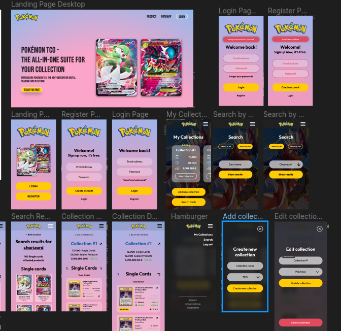

# Trading Card Game (TCG) Project

**Important:** This Demo is optimized for mobile screen.

## Tech stack used:

### - Client Side

- [Sass](https://sass-lang.com/)
- [React (JSX)](https://reactjs.org/)
- [React Router](https://reactrouter.com/en/main)
- [React Bootstrap (optional)](https://react-bootstrap.netlify.app/)
- [Vite](https://vitejs.dev/)

### - Server Side

- [NodeJS](https://nodejs.org/)
- [Express](https://expressjs.com/de/)
- [MongoDB](https://www.mongodb.com/atlas/database)
- [Render](https://render.com/)

## NPM module

> - sass
> - dotenv
> - react router
> - react bootstrap (optional)
> - mongoose
> - cors
> - express
> - jsonwebtoken
> - validator

## API

[Pokémon API](https://pokemontcg.io/)

## Project Setup

- Clone this repository
- Install all dependencies with '$ npm install'
